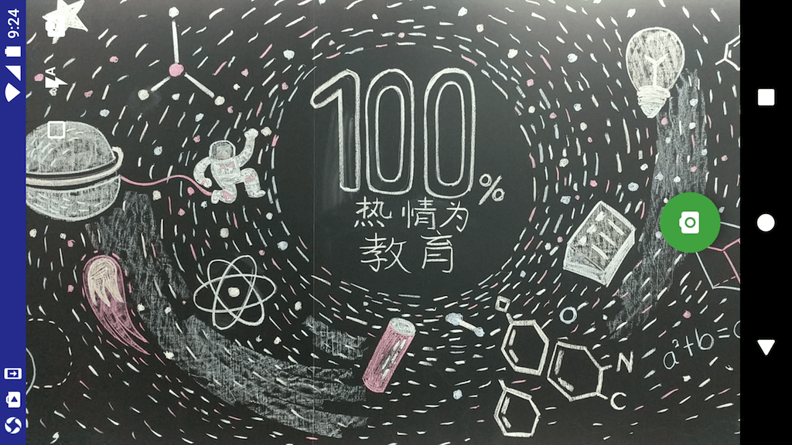

# CameraView
### 再次更改
> 想要加入自己的功能，录制视频。
> Camera1的录制功能参见：[Camera API](https://developer.android.com/guide/topics/media/camera.html#capture-video);
> 默认的视频大小比较小，setVideoSize();设置`mCameraParameters.getSupportedVideoSizes()`支持的尺寸，否则会报错
> `mRecorder.setVideoEncodingBitRate(2*1024 * 1024);`编码比特率，不设置视频会模糊，这个值还可以不模糊。  
> `Camera1#prepareRecord(file)`;对视频质量进行修改  
> `Camera2#setUpMediaRecorder(file)`;对视频质量进行修改  

### 人脸识别尝试  

### 录制压缩  


### 项目说明

这个项目基于Google的非正式开源的[CameraView](https://github.com/google/cameraview)组件，兼容Camera 1 API和Camera 2 API，提供了相机预览、切换前后摄像头、切换闪光灯、切换预览图片的比例以及拍照等功能。
CameraView这个项目可以帮助Android开发者快速创建一个可以适配不同Android系统和不同Android设备，并且包含各种基本功能的相机界面，但是它是非正式的，所以仍然存在一些兼容性问题和bug，而且原开发者并没有试图再去修复了，这正创建是自己的CameraView项目的原因。

除上述CameraView原有项目自带的几个特性之外，这个项目主要做了以下几点改进：

1.参照[lin18/cameraview](https://github.com/lin18/cameraview)的源码加入了手动对焦功能，对焦的界面显示效果也比较容易修改和定制

2.修复原始的[CameraView](https://github.com/google/cameraview)组件中的几个bug，并提升了相机启动速度和拍照时的体验等问题

3.在相机模块的使用过程中提供了完整的日志输出，并且提供了便利的`LoggingDelegate`以便在release和debug模式之间轻松控制日志输出级别

详细的介绍以及Android端相机相关开发的经验请看[这篇文章](http://javayhu.me/blog/2017/09/25/camera-development-experience-on-android/)

### 应用界面



### 原始项目介绍

下面是[CameraView](https://github.com/google/cameraview)组件的原始说明文档，我觉得其中有个小错误，API Level为24的时候的`Preview View`是`TextureView`，原始文档写的是`SurfaceView`

*This is a preview release. The API is subject to change.*

This is not an official Google product.

CameraView aims to help Android developers easily integrate Camera features.

Requires API Level 9. The library uses Camera 1 API on API Level 9-20 and Camera2 on 21 and above.

| API Level | Camera API | Preview View |
|:---------:|------------|--------------|
| 9-13      | Camera1    | SurfaceView  |
| 14-20     | Camera1    | TextureView  |
| 21-23     | Camera2    | TextureView  |
| 24        | Camera2    | TextureView  |

## Features

- Camera preview by placing it in a layout XML (and calling the start method)
- Configuration by attributes
  - Aspect ratio (app:aspectRatio)
  - Auto-focus (app:autoFocus)
  - Flash (app:flash)

## Usage

```xml
<com.google.android.cameraview.CameraView
    android:id="@+id/camera"
    android:layout_width="match_parent"
    android:layout_height="wrap_content"
    android:keepScreenOn="true"
    android:adjustViewBounds="true"
    app:autoFocus="true"
    app:aspectRatio="4:3"
    app:facing="back"
    app:flash="auto"/>
```

```java
    @Override
    protected void onResume() {
        super.onResume();
        mCameraView.start();
    }

    @Override
    protected void onPause() {
        mCameraView.stop();
        super.onPause();
    }
```

You can see a complete usage in the demo app.

## Contribution

See [CONTRIBUTING.md](/CONTRIBUTING.md).
